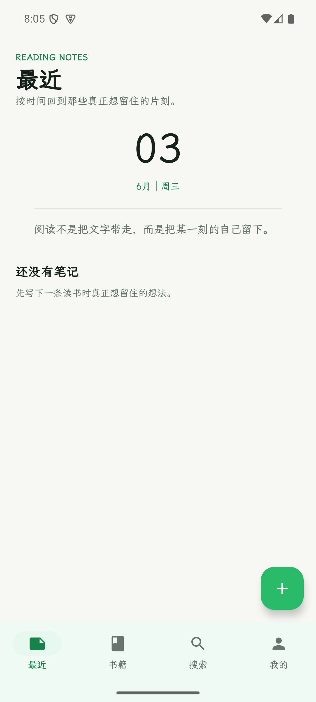
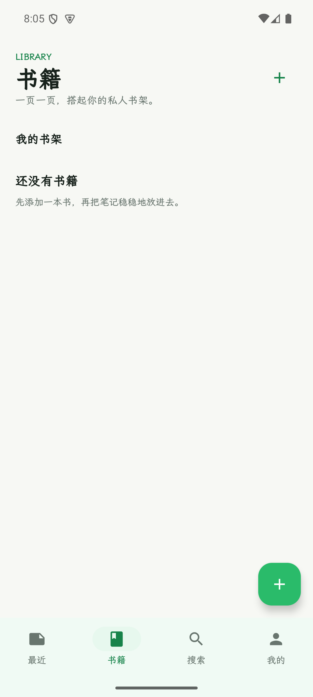
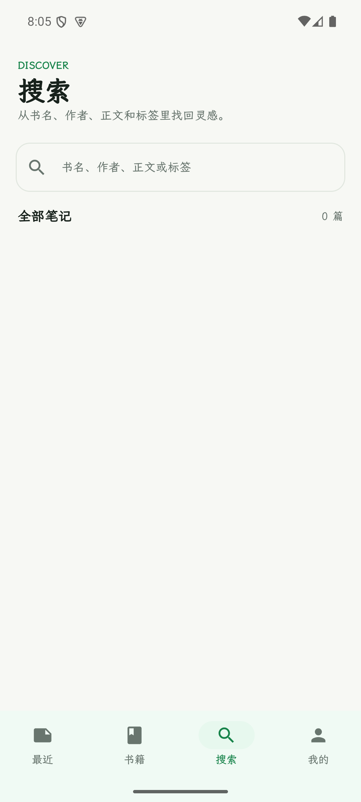
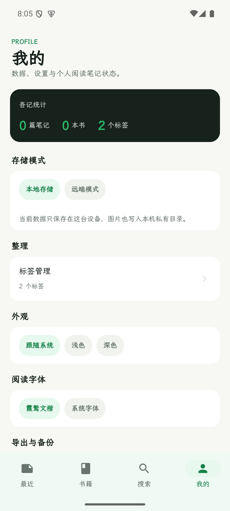

# 吾记 Android / Biji Android

吾记 Android 是一个本地优先的读书笔记客户端。它使用 Kotlin、Jetpack Compose、Room、Retrofit/OkHttp、Coroutines 和基于 `EditText + Spannable` 的富文本编辑器构建，适合记录摘抄、想法、书籍和标签。

Biji Android is a local-first reading notes client built with Kotlin, Jetpack Compose, Room, Retrofit/OkHttp, Coroutines, and a Spannable-backed rich text editor. It helps readers keep excerpts, thoughts, books, and tags organized on Android.

## 截图 / Screenshots

| 最近 / Recent | 书籍 / Books |
| --- | --- |
|  |  |

| 搜索 / Search | 我的 / Profile |
| --- | --- |
|  |  |

## 中文说明

### 主要功能

- 最近：按时间查看读书笔记，并快速进入笔记详情。
- 书籍：维护私人书架，每本书可关联多条笔记。
- 搜索：从书名、作者、笔记正文和标签中查找内容。
- 我的：切换本地/远端存储模式，管理标签、主题、阅读字体和导出备份。
- 编辑器：支持文字、图片、标签、书籍选择、OCR 摘抄入口和富文本兼容结构。
- 本地优先：默认数据保存在设备本地；网络失败不影响本地阅读和记录。

### 使用方式

1. 打开 App 后进入「最近」页，点击右下角加号新建笔记。
2. 在编辑页选择或新建一本书，输入笔记正文，也可以添加标签和图片。
3. 在「书籍」页查看书籍列表，进入书籍详情后可按标签筛选该书笔记。
4. 在「搜索」页输入关键词，检索书名、作者、正文或标签。
5. 在「我的」页切换主题和字体，使用 Markdown/JSON 导出做迁移或备份。

### 构建

从 `android/` 目录执行：

```sh
export JAVA_HOME=/opt/homebrew/opt/openjdk@17/libexec/openjdk.jdk/Contents/Home
export ANDROID_SDK_ROOT=/opt/homebrew/share/android-commandlinetools
export ANDROID_HOME="$ANDROID_SDK_ROOT"
export PATH="$ANDROID_SDK_ROOT/platform-tools:$PATH"

./gradlew testDebugUnitTest assembleDebug assembleRelease
```

模拟器默认 API 地址是 `http://10.0.2.2:8080/`。如需连接本地后端，在仓库上级的 `server/` 目录启动：

```sh
go run ./cmd/api
```

### 模拟器测试

```sh
export ANDROID_SDK_ROOT=/opt/homebrew/share/android-commandlinetools
export ANDROID_HOME="$ANDROID_SDK_ROOT"
export PATH="$ANDROID_SDK_ROOT/emulator:$ANDROID_SDK_ROOT/platform-tools:$PATH"

emulator -avd biji_api35
./gradlew connectedDebugAndroidTest
```

### Release 打包与上传

```sh
./gradlew clean assembleRelease
```

APK 输出位置：

```sh
app/build/outputs/apk/release/app-release.apk
```

创建并推送 tag：

```sh
git tag -a v1.0.0 -m "Release v1.0.0"
git push origin v1.0.0
```

上传到 GitHub Release：

```sh
gh release create v1.0.0 app/build/outputs/apk/release/app-release.apk \
  --repo yaowencurry/wuji-android \
  --title "v1.0.0" \
  --notes "Initial Android release."
```

如果 Release 已存在：

```sh
gh release upload v1.0.0 app/build/outputs/apk/release/app-release.apk \
  --repo yaowencurry/wuji-android \
  --clobber
```

## English

### Features

- Recent: review notes in chronological order and open note details quickly.
- Books: maintain a private library and attach multiple notes to each book.
- Search: find notes by title, author, body text, or tag.
- Profile: switch storage mode, manage tags, theme, reading font, and export backups.
- Editor: supports text, images, tags, book selection, OCR entry points, and rich-text-compatible data.
- Local-first: data stays available on device; network failures do not block local reading or writing.

### How To Use

1. Open the app on the Recent tab and tap the plus button to create a note.
2. Pick or create a book, write the note body, then add tags or images when needed.
3. Use the Books tab to browse your library and filter a book's notes by tag.
4. Use the Search tab to search across book titles, authors, note content, and tags.
5. Use the Profile tab to change theme/font settings and export Markdown or JSON backups.

### Build

Run commands from `android/`:

```sh
export JAVA_HOME=/opt/homebrew/opt/openjdk@17/libexec/openjdk.jdk/Contents/Home
export ANDROID_SDK_ROOT=/opt/homebrew/share/android-commandlinetools
export ANDROID_HOME="$ANDROID_SDK_ROOT"
export PATH="$ANDROID_SDK_ROOT/platform-tools:$PATH"

./gradlew testDebugUnitTest assembleDebug assembleRelease
```

The emulator build uses `http://10.0.2.2:8080/` for the Biji API. To run the local backend, start the server from `../server`:

```sh
go run ./cmd/api
```

### Emulator

```sh
export ANDROID_SDK_ROOT=/opt/homebrew/share/android-commandlinetools
export ANDROID_HOME="$ANDROID_SDK_ROOT"
export PATH="$ANDROID_SDK_ROOT/emulator:$ANDROID_SDK_ROOT/platform-tools:$PATH"

emulator -avd biji_api35
./gradlew connectedDebugAndroidTest
```

### Release

Build the release APK:

```sh
./gradlew clean assembleRelease
```

APK output:

```sh
app/build/outputs/apk/release/app-release.apk
```

Create and push a release tag:

```sh
git tag -a v1.0.0 -m "Release v1.0.0"
git push origin v1.0.0
```

Upload the APK to GitHub Releases:

```sh
gh release create v1.0.0 app/build/outputs/apk/release/app-release.apk \
  --repo yaowencurry/wuji-android \
  --title "v1.0.0" \
  --notes "Initial Android release."
```

If the release already exists:

```sh
gh release upload v1.0.0 app/build/outputs/apk/release/app-release.apk \
  --repo yaowencurry/wuji-android \
  --clobber
```
